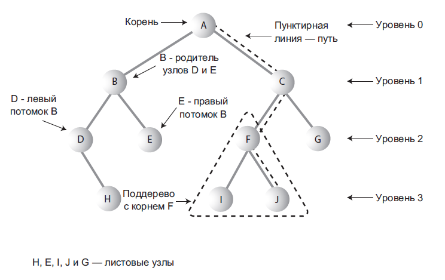

# Алгоритмы

## Категории алгоритмов и примеры

### Работа со структурами данных (поиск/вставка/удаление)
+ Массивы - это структура данных, в которой хранятся элементы одного типа. Его можно представить, как набор пронумерованных ячеек, в каждую из которых можно поместить какие-то данные (один элемент данных в одну ячейку).
    + Хороши для поиска по индексу и вставок/удалений в конце
    + Плохи при вставках/удалениях в начало/середину, т.к. требуется копировать и перемещать часть массива
    + Если массив упорядочен, то для поиска элемента можно использовать двоичный поиск (сложность - O(log(n)), это быстрее линейного у которого O(n)) - брать элемент посередине, и сравнивать его с искомым. Если искомое больше, чем элемент сравнения, то сужаем область поиска до правой части массива, затем опять делим ее пополам и т.д.
+ Связанные списки - элементы содержат ссылки на предыдущий и следующий и образуют цепочки (пример - LinkedList)
    + Хороши для вставок/удалений в начале и конце
    + Плохи для поиска по инедксу и вставок/удалений в середине, т.к. придется обходить элементы в цикле
+ Стек - LIFO (Last In First Out — последним пришёл — первым ушёл)
+ Очередь - FIFO (First In First Out — первым пришёл — первым ушёл)
+ Приоритетная очередь - сортировка на основе компаратора
+ Деревья - структуры состоящие из узлов (вершин), которые соединяются между собой ребрами. Верхний узел - корень. Позволяют хранить элементы, которые можно сравнивать по какому-либо ключу, чтобы правильно распределить их по узлам
    + 
    + Несбалансированные деревья - то есть большинство узлов сосредоточено с одной или с другой стороны корня
        + В несбалансированном дереве теряется возможность быстрого поиска (а также вставки или удаления).
    + Двоичные деревья - каждый узел дерева имеет не более двух потомков
        + Двоичное дерево сочетает в себе преимущества двух других структур: упорядоченного массива и связанного списка
        + Наибольшая эффективность достигается при вставке случайных значений. Если вставляемые значения уже упорядочены, двоичное дерево становится несбалансированным
        + Сложность всех операций в лучшем случае (дерево сбалансировано) - O(log(n))
        + Сложность всех операций в худшем случае (дерево в виде одной ветви) - O(n)
    + Красно-черные деревья - в отличии от двоичных состоит в том, что они всегда сбалансированы. При вставке/удалении структура такого дерева, меняется (балансируется)
        + Красно-черные правила:
            1. Каждый узел окрашен в красный или черный цвет.
            2. Корень всегда окрашен в черный цвет.
            3. Если узел красный, то его потомки должны быть черными (хотя обратное не всегда истинно).
            4. Все пути от корня к узлу или пустому потомку должны содержать одинаковое количество черных узлов.
        + Сложность всех операций не хуже O(log(n))
    + Деревья 2-3-4 - многопутевые деревья, у которых каждый узел может иметь до четырех потомков и трех элементов данных.
        + 
+ Хеш-таблицы - пример HashMap
+ Пирамиды
+ Графы
+ Взвешенные графы

### Алгоритмы сортировки
+ [Пузырьковая сортировка](../src/main/java/examples/algorithms/BubbleSortingTest.java)

### Рекурсия
+ [Рекурсивное вычисление факториала и числа фибоначчи](../src/main/java/examples/algorithms/RecursionTest.java)

## Оценка сложности алгоритмов O(f(n))

### Что такое O(f(n))
+ O(1) - затраты времени не зависят от размера задачи
+ O(log(n)) - при увеличении размера задачи вдвое, затраты времени меняются на постоянную величину
    + loga(n) = x, где a - основание, n - результат возведения в степень, x - степень основания
        + Бывают ln (ln(n)= loge(n), e = 2,71828...) и lg (lg(n)= log10(n))
    + Основание нам не важно, главное порядок изменения сложности при увеличении объема входных данных (n)
+ O(n) - при увеличении размера задачи в 2 раза, затраты времени возрастут тоже в два раза
+ O(n2) - при увеличении размера задачи в 2 раза, затраты времени возрастут примерно в четыре раза
+ O(n\*log(n)) - при увеличении задачи в два раза, затраты времени возрастут в два раза, плюс некоторая прибавка, относительный вклад которой уменьшается с ростом n. При малых n может вносить очень большой вклад. O(n*log(n)) начинает расти как квадрат при малых n, но потом рост замедляется почти до линейного
+ 

### Примеры
+ O(n) — линейная сложность
Такой сложностью обладает, например, алгоритм поиска наибольшего элемента в не отсортированном массиве. Нам придётся пройтись по всем n элементам массива, чтобы понять, какой из них максимальный.

+ O(log n) — логарифмическая сложность
Простейший пример — бинарный поиск. Если массив отсортирован, мы можем проверить, есть ли в нём какое-то конкретное значение, методом деления пополам. Проверим средний элемент, если он больше искомого, то отбросим вторую половину массива — там его точно нет. Если же меньше, то наоборот — отбросим начальную половину. И так будем продолжать делить пополам, в итоге проверим log n элементов.

+ O(n2) — квадратичная сложность
Такую сложность имеет, например, алгоритм сортировки вставками. В канонической реализации он представляет из себя два вложенных цикла: один, чтобы проходить по всему массиву, а второй, чтобы находить место очередному элементу в уже отсортированной части. Таким образом, количество операций будет зависеть от размера массива как n * n, т. е. n2.

### Сложности Java Collections API
+ ArrayList
    + лучшее O(1) - чтения из любого места (прямой доступ к памяти через массив) и вставка в конец;
    + худшее O(n) - вставка - будет тем хуже чем ближе к началу, т.к. придется копировать больше элементов. Например если вставлять в середину то будет O(n/2)
	
+ LinkedList
    + лучшее O(1) - все операции с первым/последним элементом;
    + худшее O(n) - все операции с элементом в середине, т.к. придется делать обход в цикле	
    
+ HashMap/HashSet
    + лучшее O(1) - все операции, если коллизий нет и вставка даже если коллизий много (т.к. вставляется в начало или конец корзины - связного списка);
    + худшее O(log(n)) - чтение, если у всех элементов одинаковый hashCode - начиная с Java 8 после достижения определенного порога размера корзины вместо связанных списков используются сбалансированные деревья (до этого было O(n))
  	
+ LinkedHashMap/LinkedHashSet
    + O(1)/O(log(n)) - так же как и у HashMap, но чуть больше памяти на хранение связей;
        
+ TreeMap/TreeSet
    + гарантировано не хуже O(log(n)) - все операции, т.к. красно-черное дерево гарантирует такую сложность в худшем случае
